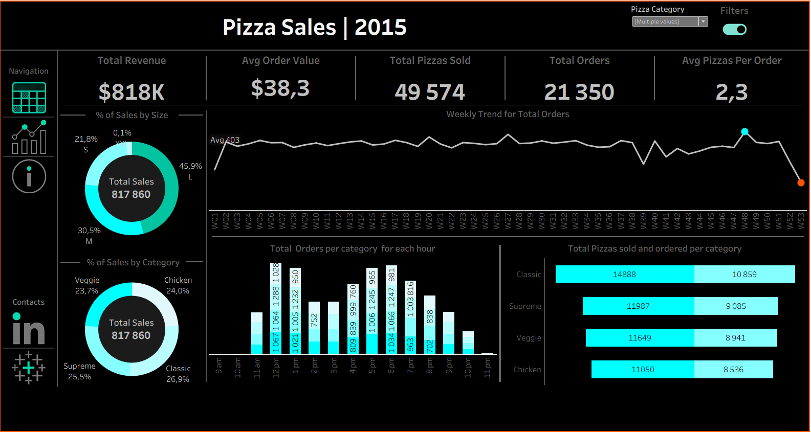

# PizzaSales-Dashboard
I created this dashboard as part of my Tableau revision, practising how to work with Tableau without following instructions from any professional. I was only trying to fulfill the stakeholder requirements

## Introduction
🚀 Excited to share my latest Data Analytics project: Transforming Pizza Sales Data into Actionable Business Intelligence!
  
I recently completed a comprehensive analysis of 2015 pizza sales data using Tableau, focusing on how data-driven insights can optimise operations and drive revenue growth. By moving beyond raw numbers, I uncovered the "why" behind the performance of a high-volume retail environment.

📊 Key Business Metrics & KPIs
To measure the pulse of the business, I developed a dynamic dashboard tracking:
        
    1. Total Revenue & Average Order Value (AOV): Identifying the financial baseline and spending patterns.
    2. Sales Volume: Tracking total pizzas sold and total orders to monitor demand.
    3. Operational Efficiency: Analysing average pizzas per order to understand basket size.

🔍 Deep-Dive Insights
The analysis went deeper into the "what" and "when" to provide strategic recommendations:

    1.Inventory & Menu Optimisation: Identified the Top & Bottom Sellers by quantity, orders, and revenue—essential for menu engineering and waste reduction.
    2.Peak Hour Intelligence: Visualised total orders per category for every hour of the day, allowing for better staff scheduling and kitchen preparedness.
    3.Market Segmentation: Calculated the percentage of sales by Pizza Category and Size to pinpoint customer preferences and target marketing efforts effectively.
  
This project demonstrates my ability to translate complex datasets into clear, visual stories that empower stakeholders to make informed, high-impact decisions.

🔗 Feel free to explore the Interactive Dashboard: https://public.tableau.com/app/profile/donald.masine/viz/PizzaSales_17703224511910/PizzaSalesDashboard

## Acknowledgements:
A huge shoutout to Baraa Salkini for his incredible YouTube Tableau course! His expert guidance was instrumental in helping me master advanced visualisation techniques and bring this data to life.

## Project Status
    COMPLETE

## Contact

I welcome connections and conversations regarding opportunities, collaborations, or shared interests in technology and data. Please feel free to reach out through any of the following channels:

*          
*  **Phone:** +27 71 436 6053
